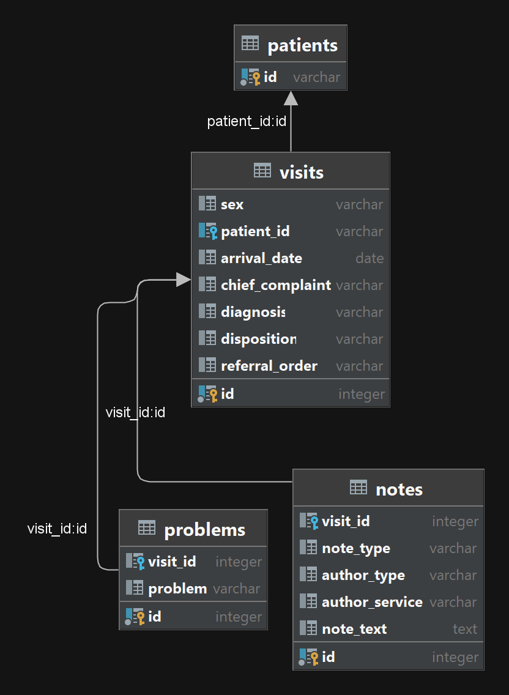

# ED NLP parsing scripts

This repository contains all the code and context rules that are used to parse ED notes for headache and vomitting. I have 
uploaded the parsed notes to hpf space. There are several steps to process ed notes from the way they were provided. 

These steps are:

+ Remove patient information 
  + This meant that some notes were removed since they only contained summaries and a whole bunch of information about the
  patient that could be used to identify them. Deidentification is good but not perfect. Some portions of the names in a
  very small subset of the patients in some notes remain. 
+ Create a note database for easy query
  + We have 2.5M patient notes, loading all of them is not possible, parsing excel or csv files is slow. To speed up the process
  I've created a small sqlite database that can be queried using sqlalchemy there are examples in the code 
+ Generate new context rules, target rules and edit existing context rules from medspacy
  + This was the most cumersome part and a  lot of trial and error. Since the patient notes do not have proper sentence 
  structure or grammar, spacy really struggles with spans and contexts. Going over a large number of notes and generating
  custom rules mitigates this to a certain extent but it is not perfect. All the "new" rules are in `rules.py` and the 
  edited (some not all) medspacy rules are in `context_rules.json`
+ Script to query the database and parse the notes
  + This is the `parse_notes.py` script. There are some things that are hardcoded like the path of the database. Since 
  there is only one databse and it's a sqlite one it's easy to change. I'm going to leave it as is because I'm not sure
  how we are going to proceed from here. If we will do EPIC api calls then there is no need for a databasse (EPIC is the 
  database).
+ All the other functions that do not directly fit in the workflow of the script are in `utils.py` and the dependencies
are in `requirements.txt`.
+ The data is processed on my laptop with a RTX3080Ti (w 16 GB vram). You can use cpu and a smaller spacy base model but
the transformer model is more accurate and with gpu it is almost as fast.

I decided to keep this rule based instead of training a new model for the following reasons:

+ if we want to change the symptoms it's a matter of writing another set of target rules and we can just use it as is. 
+ This gets rid of the requirement for training a new model with each set of symptoms. We can still use this to pull notes
and then with some human labelling we can generate a new dataset for transfer learning. 

I tried to comment all the functions as much as I can in each script but if you have any questions please do not hesitate
to email me. 

# Some details about each script:

## `anonymize.py`

This is the script for removing phi. Based on the excel files I'm keeping a number of hard coded columns. Each excel file
is read in a look and for each excel file the patient name is replaced with a `uuid4`. Other columns like mrn is removed as well

Then the note text is converted to a `spacy` `Doc` class and lemmatized. For each lemma we look for whether that lemma 
is a name and if so we check if this the patient name with a levenshtein distance of 0 for names less than 4 letters, 1 for less than 6 letters
but > 4 and 2 for longer. 

I also remove some things like `mrn(:| )*[0-9]+` and `dob(:| )*[0-9]+/[0-9]+/[0-9]+` for obvious reasons. All the notes
that contain anthing about a discharge summary are removed since these are summaries of all notes and a nightmare cocktail of phi.

After all this the processed dataframe is saved as a csv. 

This is an inefficient way to process the data but it is highly accurate than simple regex search. The only downside is if the 
doctor has the same names as the patient that name is also removed. This in the long run can create some issues like identifying
the patient by proxy but for this project we are probably ok.  

## `create_notes_db.py`

This generates the notes databse, it's a simple sqlite database but it is a lot faster for searching specific notes than
going through csv files generated above. The script contains the table classes and the code that generates and inserts the
data to the tables.

the database scheme is below:

 

## `parse_notes.py`

This does the parsing of the ed notes. There is a hardcoded list that performs a `%like%` search on the database for ed notes
that contain the lemmas we are looking for. This is the first step in the search to enrich the results for what we are looking
for. Then the note text is split into sentences and each sentence is searched whether the patient is actively experiencing the 
symptoms we are looking for. This can become quite extensible if we were to dynamically generate target rules. I've parsed all the 
ed notes that were returned from the sql query and saved the results as a json file. The structure of the json is as follows. 

```json
{
  "note_id" : "int",
  "visit_id" : "int",
  "note_type": "str", 
  "author_type": "str", 
  "author_service": "str", 
  "note_text": "str",
  "note_problems": ["list of problems"],
  "relevant_sentences": {"sentence": "sentence", "problems":["list of problems"]}
}
```

This is rather heavy on the gpu and processing 30K notes takes several hours. 

# Performance

The performance is tested on 1000 human (me, i'm the human) labelled sentences (not notes). I decided to tweak the rules
to decrease false negative while sacrificing (a little) false positives. Since this is planned to be an "early warning" system
it's better to be on the more cautious side. 

The notes are split into sentences and each sentence is then searched for the symptoms. The "symptoms" of the note is the 
uniion of all the symptoms in each sentence. Since there are multiple sentences in each note before labelling I split the notes
into sentences and shuffled the sentences. This is to ensure that I am not labelling multiple sentences from the same note. 

The query focused on notes that contained **both** vomiting and headache mentioned in them, since this was our goal. It is possible
to search them separately but that increases the number of notes to parse, and it is not what we want. 

Based on the labelled sentences the performance is below. 

### For each possible outcome

| class          | precision | recall | f1-score | support |
|----------------|-----------|--------|----------|---------|
| headache       | 0.93      | 0.89   | 0.91     | 405     |
| none           | 0.86      | 0.90   | 0.88     | 287     |
| vomit          | 0.90      | 0.93   | 0.91     | 156     |
| vomit,headache | 0.88      | 0.88   | 0.88     | 152     |


### Global stats

|              | precision | recall | f1-score | support |
|--------------|-----------|--------|----------|---------|
| accuracy     |           |        | 0.90     | 1000    |
| macro avg    | 0.89      | 0.90   | 0.90     | 1000    |
| weighted avg | 0.90      | 0.90   | 0.90     | 1000    |


It's quite hard to go above 90% with just rules. The main culprit is not the rules themselves but the fact that they assume
the notes are written in complete sentences. When there is a mess of drug names, run on sentences that become a whole paragraph
the rules have a hard time figuring out how far they should modify. 